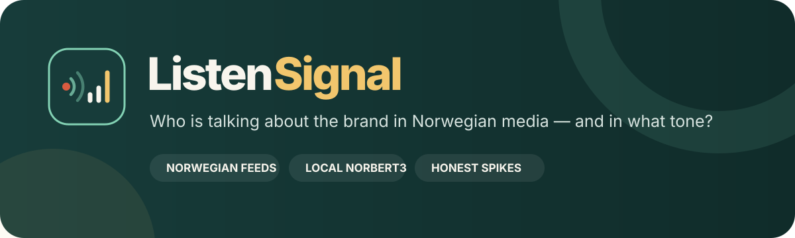
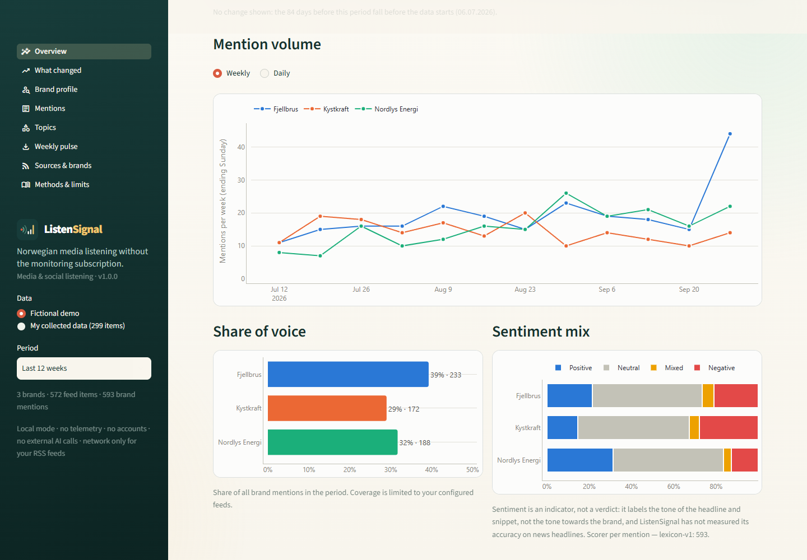
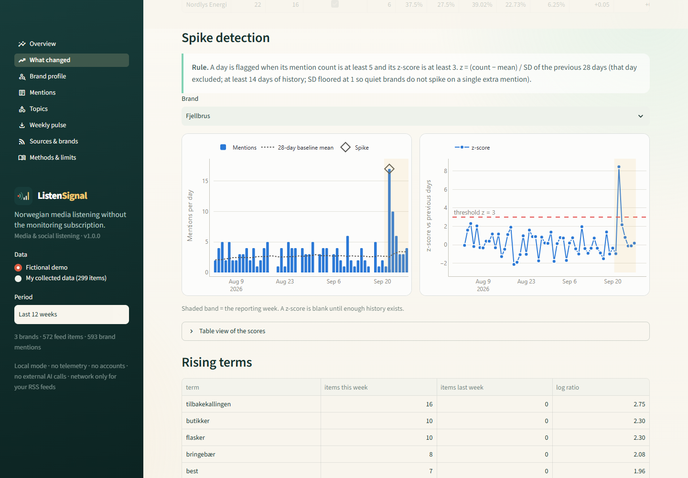
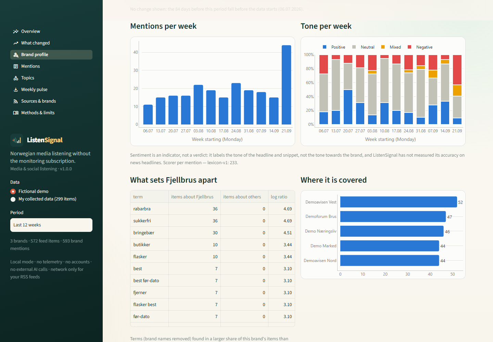

<p align="center">
  
</p>

<p align="center">
  
  
  <a href="LICENSE"></a>
</p>

<p align="center"><strong>Open Norwegian media listening: mentions, share of voice and Norwegian-language sentiment, run locally.</strong></p>

> **Working-name status:** no company-name, domain or trademark screen has been done for “ListenSignal” yet.
> Treat the name as provisional.

**ListenSignal** is an open, local-first media and social listening tool for **Norwegian-language sources**. It is
a free alternative for small brands to paid monitoring services such as Retriever, Meltwater and Brandwatch. The
open-source listening tools checked on 1 October 2026 (Obsei, OpenMagpie, Harken) are English-first, and none of
them handles Norwegian sources or Norwegian sentiment. ListenSignal answers one question:

> How often is our brand (and each competitor) mentioned in Norwegian media and forums, in what tone, about which
> topics — and what changed this week?

Everything runs on your machine. There are no accounts, no telemetry and no external AI calls. The only network
traffic is to the RSS feeds you configure, plus a one-time optional model download.

<p align="center"></p>

## Read this first

ListenSignal counts **what the configured feeds published while the collector ran**. It does not measure what
people think, how many people saw a story, or why a change happened.

- **Coverage is limited by design.** v1 reads RSS/Atom feeds only: headlines and the short snippet each feed
  publishes. It does not scrape articles, store full text, read paywalled content, or cover X/Twitter, Instagram,
  TikTok or Facebook.
- **Sentiment is an indicator, not a verdict.** It labels the tone of a headline and snippet, not the tone
  *towards your brand*. NorBERT3 measured a weighted F1 of 0.749 on Norwegian *review* sentences; the lexicon
  fallback measured 0.498. Accuracy on *news headlines* has not been measured, and NorBERT3 labels most news
  Neutral. See [the sentiment evaluation](docs/sentiment-evaluation.md).
- **Spikes are a screening rule, not proof.** With many brand-days on screen a few flags will be ordinary noise.
  The rule and threshold are shown next to every flag.
- **A new installation has no history.** Week-over-week changes and spike baselines need two full weeks of
  collection; until then the app says so instead of reporting gaps in collection as news.

## Try the fictional demo in three minutes

1. Start the app (`run_app.bat` on Windows). The fictional demo is already loaded and works offline.
2. **Overview:** weekly mention volume for three invented drinks brands — *Fjellbrus* (own brand), *Kystkraft* and
   *Nordlys Energi* — with share of voice, sentiment mix and top sources.
3. **What changed:** the final demo week holds an engineered spike, a fictional Fjellbrus product recall. Its
   knock-on stories also lift a competitor, Nordlys Energi, two days later. Read the plain-language notes, the
   z-score chart with its threshold line, and the rising terms (*tilbakekaller …*).
4. **Brand profile:** one brand's weekly volume and tone, the words that set its coverage apart, its sources and
   its latest positive and negative items.
5. **Mentions:** filter by brand, tone or source, and see which alias text triggered each match.
6. **Topics:** headline groups with their top terms.
7. **Sources & brands:** paste a headline into the matcher tester. The demo's Nordlys Energi aliases include
   “Nordlys”, and the exclusions stop aurora headlines (“nordlyset”) from counting. Under **Edit brands for this
   session**, change aliases or add your own brand: every page re-matches the same items, and nothing is written to
   disk.
8. **Weekly pulse:** download the one-page HTML summary and the XLSX workbook.

**The demo is fictional.** Every brand, outlet, headline and link in it is generated by code
(`src/listensignal/demo.py`, links on the reserved `.invalid` domain). It describes no real company or
publication. The app says so on every page that shows demo data.

<p align="center"></p>

<p align="center"></p>

## Sources and brands

### `brands.yaml`

```yaml
brands:
  - name: Tine
    role: own                     # own | competitor
    aliases: [Tine, TINE, TINE SA]
    exclude: [Tine Sundt]         # "Tine Sundt" is a person, not the dairy
    case_sensitive: true          # "tine" is also a verb (to thaw)
  - name: Q-Meieriene
    role: competitor
    aliases: [Q-Meieriene, Q-meieriet]
```

Matching works on word boundaries and is case-insensitive unless `case_sensitive: true`. It allows one Bokmål or
Nynorsk suffix: genitive *-s*; definite and plural *-en, -et, -a, -ene, -ane, -er, -ar* and their genitives. It
also matches hyphenated compounds (“Tine-sjefen”). Closed compounds (“Tinemelk”) are not matched unless you list
them as aliases. A hit that overlaps an exclusion phrase is discarded. Exclusions are inflected too, so “Tine
Sundts” is excluded as well. Set `inflect: false` for exact matching.

### `sources.yaml`

Every seeded feed URL was fetched on **1 October 2026** with ListenSignal's User-Agent and checked against the
site's robots.txt.

| Seeded on | Feeds |
|---|---|
| **Enabled** (robots.txt allows) | VG, E24, Aftenposten, Nettavisen, Kampanje, Teknisk Ukeblad |
| **Disabled**, with the reason in the file | NRK (robots.txt reserves text and data mining without written permission) · Dagbladet (content signal `ai-input=no`) · DN (robots.txt: media monitoring requires an agreement) · Google News RSS with `hl=no&gl=NO` and r/norge (both disallowed by robots.txt) |
| **Dropped** | Finansavisen and Kom24: no working public feed found |

The collector enforces its politeness rules in code:

- it sends a descriptive User-Agent;
- it re-checks robots.txt on every run and skips a disallowed or unreachable feed;
- it polls each feed at most once every 30 minutes (configuration can raise this, never lower it);
- it uses conditional requests (ETag / Last-Modified);
- it never opens article pages.

Publishers' terms change, so read each note before enabling a feed.

```bash
python -m listensignal.collect               # all enabled feeds
python -m listensignal.collect --only "NRK toppsaker"   # one feed, even if disabled (only with permission)
python -m listensignal.collect --sentiment lexicon      # force the fallback scorer
python -m listensignal.collect --rescore     # re-label items scored by a different scorer
```

### Schedule collection

Feeds are a sliding window of each outlet's latest items (VG's carries only 10), so ListenSignal sees only what
is in the feed when it polls. Poll every 30–60 minutes for continuous coverage. When every item in a feed is new
since the last poll, the collector reports a **possible gap**: older items probably rolled out of the feed
unseen. Each run of `run_collect.bat` collects once and appends to `logs\collect.log`. To run it every 30 minutes
with Windows Task Scheduler:

```bash
schtasks /Create /TN "ListenSignal collect" /SC MINUTE /MO 30 /TR "C:\path\to\media-listening\run_collect.bat"
un_collect.bat\""
```

Remove the task again with `schtasks /Delete /TN "ListenSignal collect" /F`. The app's **Sources & brands** page
also has a **Collect now** button.

The database lives in `data/listensignal.db` (gitignored). It stores the headline, the feed snippet (capped at 400
characters), the link, the source, the published time and the sentiment label with its scorer. Items are
de-duplicated by normalized URL (tracking parameters removed) and by a hash of the normalized headline, so a wire
story published by several outlets counts once.

## Methods

- **Sentiment.** With the optional extra, `ltg/norbert3-base_sentence-sentiment` (University of Oslo, Language
  Technology Group; CC-BY-4.0) runs locally on CPU. It is pinned to revision `a6f5633` because it needs
  `trust_remote_code=True`, and it is loaded from the local cache only. Without the extra, a transparent
  Bokmål/Nynorsk word list with simple negation is used. Both scorers label each sentence and then combine them:
  Mixed if any sentence is Mixed or both Positive and Negative occur; otherwise Positive, then Negative, then
  Neutral. Every stored label records which scorer produced it. Net tone = (positive − negative) / scored mentions.
- **Share of voice** = a brand's mentions / all brand mentions in the period. An item naming two brands counts
  once for each.
- **Spikes.** A day is flagged when its count is at least 5 and its z-score is at least 3.0. The z-score is
  z = (count − mean) / SD over the previous 28 days, excluding that day, with at least 14 days of history and the
  SD floored at 1. Days before the first collection are never scored. Threshold and minimum count are adjustable
  on screen.
- **What changed** compares the last 7 days with the 7 before. Notes appear for spikes, for volume changes of at
  least 50 % and 5 mentions, and for rises of at least 15 points in the negative share.
- **Topics.** TF-IDF over headline + snippet (1–2-word terms; Norwegian stop-words and brand names removed) feeds
  LSA (20 dimensions) and then k-means with a fixed seed. Each group is described by its highest mean-TF-IDF terms.
  Rising terms compare the share of items containing a term this week and last week.
- Daily buckets use Norwegian time (Europe/Oslo). See **Methods & limits** in the app.

## Weekly brand pulse

The **Weekly pulse** page, or `python -m listensignal.pulse [--demo]`, writes two files:

- a **one-page HTML summary**: what changed, a per-brand table (mentions, change, share of voice, net tone,
  sentiment mix, spike days), rising terms, top sources, latest mentions, and the spike rule, sentiment limits and
  coverage limits;
- an **XLSX workbook** with every table behind it: About, What changed, Week vs week, Share of voice, Sentiment
  mix, Spikes, Daily counts, Top sources, Rising terms, Mentions.

Every cell is sanitized against spreadsheet formula injection, which matters because Norwegian headlines often
start with “- ”. The HTML escapes all feed text.

## Run locally

You need Python 3.10 or newer.

**Windows:** double-click `run_app.bat`. **macOS:** double-click `run_app.command`.

The first launch creates a private `.venv` and installs the open-source dependencies. The dashboard opens at
`http://127.0.0.1:8595` with the fictional demo loaded; no network is needed. Set `LISTENSIGNAL_PORT` to change the
port. Set `LISTENSIGNAL_PUBLIC_DEMO=1` for a hosted demo: the app then shows only the fictional data, and
collection is switched off, so it never fetches feeds or writes a database. Or from a terminal:

```bash
python -m venv .venv
.venv\Scripts\activate            # macOS/Linux: source .venv/bin/activate
python -m pip install -e .            # the package, its CLI commands and dependencies
python -m streamlit run app.py
```

### Optional: local NorBERT3 sentiment

```bash
python -m pip install torch --index-url https://download.pytorch.org/whl/cpu
python -m pip install "transformers>=4.36,<5"
python -m listensignal.sentiment --download
```

The download is about 0.5 GB and happens once. The model's remote code is incompatible with transformers 5, hence
the pin. After this, `collect` uses NorBERT3 automatically; without it, the lexicon fallback is used and labelled
as such.

### Docker

```bash
docker build -t listensignal .
docker run --rm -p 8595:8595 -v ./data:/app/data listensignal
```

## Privacy

ListenSignal stores no personal data beyond what appears in public headlines and feed snippets: names of people
in the news can appear there. It has no accounts, telemetry, tracking or external AI calls. See
[PRIVACY.md](PRIVACY.md).

## Development checks

```bash
python -m pip install -e ".[test]"
python -m pytest
python -m ruff check .
python scripts/evaluate_sentiment.py      # optional: downloads the NoReC test split to data/eval/
```

The tests cover:

- alias and exclusion matching, including Bokmål and Nynorsk inflections;
- URL and headline de-duplication, and that only snippets are stored;
- robots.txt handling, the 30-minute poll floor and conditional requests;
- spike detection, coverage awareness and week-over-week notes;
- the lexicon fallback and scorer labelling (NorBERT3 too, when installed);
- demo determinism, topics, the pulse export and formula-injection protection;
- every Streamlit page;
- an architecture test that fails if anything under `src/` imports Streamlit.

### Architecture

All logic, data models and storage live in `src/listensignal/` and never import Streamlit, so a future
**Signal Hub** can reuse them. The public API is in `src/listensignal/__init__.py`, and SQLite sits behind
`storage.py`. Streamlit code lives only in `app.py` and `pages/`.

## Relationship to the Signal suite

ListenSignal is part of the [Signal suite](https://ulrikerlingsen.com/): local-first, explainable marketing tools
with visible assumptions and fictional demos.

- **ListenSignal** listens to what Norwegian media publish about brands.
- **TrackSignal** tracks survey-based brand measures (awareness, consideration, …) with uncertainty.
- **TextSignal** analyses open-ended text in depth, beyond ListenSignal's headline-level topics.

## Academic independence and originality

ListenSignal is independently designed and written. The Norwegian lexicon, stop-word list, demo templates and code
are original to this project. NorBERT3 is used as a downloaded model under its CC-BY-4.0 licence and is not
redistributed. NoReC evaluation data are downloaded on demand and not redistributed (CC BY-NC 4.0). All bundled
demo data are fictional and generated by code.

See [CHANGELOG.md](CHANGELOG.md), [CONTRIBUTING.md](CONTRIBUTING.md), [SECURITY.md](SECURITY.md) and
[PRIVACY.md](PRIVACY.md).

## License

The software and documentation are free under **AGPL-3.0-or-later**. See [LICENSE](LICENSE).

This application was developed with AI coding assistance and checked through source review, automated tests, live
feed runs and visual inspection. Verify material decisions independently; no warranty is provided.
